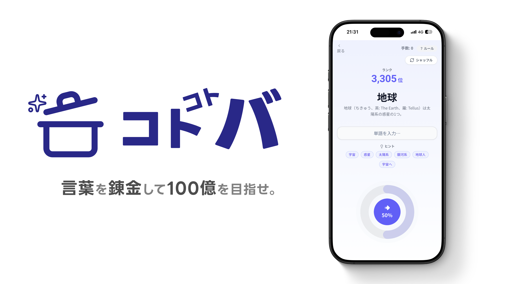

# コトコトバ

<p align="center">
  
</p>

## 「言葉を錬成して100億を目指せ。」

言葉遊びと AI 技術が融合した、新感覚のワードパズルゲーム。  
ユーザーは初期単語に対して自由な単語を「混合」する操作を繰り返し、word2vec のベクトル空間上で「100億」に近づけていきます。

## 🎮 ゲームプレイ

```
① スタート単語が表示される（例：「投資」「宇宙」など）
   → 気に入らなければ「シャッフル」で何度でも変更可能
② 単語を入力し、混合比率（mix_ratio）を調整
③ ベクトル混合 → 最も近い日本語単語に変換
④ ランク10位以内でクリア！
```

### プレイ例

| 操作     | Input | mix_ratio | Output   | ランク          |
| -------- | ----- | --------- | -------- | --------------- |
| 初期状態 | —     | —         | ミジンコ | 8,423位         |
| 混合     | お金  | 0.7       | 小銭     | 3,201位         |
| 混合     | 宇宙  | 0.6       | 星雲     | 842位           |
| 混合     | 欲望  | 0.8       | 大富豪   | 38位            |
| 混合     | 数字  | 0.5       | 兆       | 7位（クリア！） |

ランクに応じて UI 演出が変化します（白黒 → カラー → 宇宙空間 → 黄金演出）。

## 🛠 技術スタック

| カテゴリ       | 技術                                 |
| -------------- | ------------------------------------ |
| フロントエンド | Next.js 16 (App Router) / TypeScript |
| スタイリング   | Tailwind CSS v4 / shadcn/ui          |
| アニメーション | Motion (旧 Framer Motion)            |
| バックエンド   | FastAPI (Python 3.11+)               |
| ベクトル演算   | gensim (word2vec / KeyedVectors)     |
| 単語説明       | Wikipedia API                        |
| パッケージ管理 | pnpm (frontend) / uv (backend)       |
| ホスティング   | Vercel (frontend) / Render (backend) |
| コンテナ       | Docker / Docker Compose              |

## 🏗 アーキテクチャ

```
┌─────────────────────────┐         ┌─────────────────────────┐
│   Frontend (Vercel)     │  REST   │   Backend (Render)      │
│                         │  API    │                         │
│  Next.js 16 App Router  │────────▶│  FastAPI                │
│  Tailwind CSS + shadcn  │◀────────│  VectorEngine           │
│  Motion                 │         │  ├── word2vec (gensim)  │
│  PWA (iOS専用)          │         │  └── Wikipedia API      │
└─────────────────────────┘         └─────────────────────────┘
```

詳細は [docs/architecture.md](docs/architecture.md) を参照してください。

## 📦 セットアップ

### 前提条件

- Node.js 20+ / pnpm
- Python 3.11+ / [uv](https://docs.astral.sh/uv/)
- Git（サブモジュール対応）

### 1. リポジトリをクローン

```bash
git clone --recursive https://github.com/nu-chotech/coto2-ba.git
cd coto2-ba
```

> 既にクローン済みの場合：`git submodule update --init --recursive`

### 2. バックエンドの起動

```bash
cd backend
uv sync

# word2vec モデルのダウンロード（初回のみ、約 588 MB）
cd app/models
wget https://github.com/singletongue/WikiEntVec/releases/download/20190520/jawiki.word_vectors.200d.txt.bz2
bzip2 -d jawiki.word_vectors.200d.txt.bz2
cd ../..

# 開発サーバーを起動
uv run task dev
```

API は http://localhost:8000 で起動します（Swagger UI: http://localhost:8000/docs）。

### 3. フロントエンドの起動

```bash
cd frontend
pnpm install
pnpm dev
```

http://localhost:3000 でアクセスできます。

### Docker で起動（バックエンド）

```bash
cd backend
docker compose up -d --build
```

初回起動時にモデルを自動ダウンロードします。詳細は [docs/setup.md](docs/setup.md) を参照してください。

## 📁 リポジトリ構成

```
coto2-ba/
├── README.md              # このファイル
├── docs/                  # プロジェクト全体のドキュメント
│   ├── architecture.md    # システムアーキテクチャ
│   ├── api.md             # API 仕様書
│   └── setup.md           # 詳細セットアップガイド
├── frontend/              # フロントエンド（git submodule）
│   ├── src/
│   │   ├── app/           # Next.js App Router ページ
│   │   ├── components/    # React コンポーネント
│   │   ├── hooks/         # カスタムフック
│   │   ├── lib/           # ユーティリティ・API クライアント
│   │   └── types/         # TypeScript 型定義
│   └── docs/              # フロントエンド固有ドキュメント
└── backend/               # バックエンド（git submodule）
    ├── app/
    │   ├── main.py         # FastAPI アプリケーション
    │   ├── routers/        # エンドポイント定義
    │   ├── schemas/        # Pydantic モデル
    │   └── services/       # ベクトル演算コアロジック
    ├── Dockerfile
    └── compose.yml
```

## 📖 ドキュメント

| ドキュメント                                    | 内容                            |
| ----------------------------------------------- | ------------------------------- |
| [アーキテクチャ](docs/architecture.md)          | システム構成・データフロー      |
| [API 仕様書](docs/api.md)                       | バックエンド API エンドポイント |
| [セットアップガイド](docs/setup.md)             | 開発環境・Docker・デプロイ      |
| [ハッカソン全容概要](frontend/docs/spec.md)     | ゲーム仕様・プロジェクト概要    |
| [フロントエンド要件](frontend/docs/frontend.md) | フロントエンド要件定義書        |

## 👥 チーム

| メンバー | 担当                           | 役割                           |
| -------- | ------------------------------ | ------------------------------ |
| 1人目    | フロントエンド・UI/UX          | Web アプリ全体の実装・UI 設計  |
| 2人目    | バックエンド (LM/ベクトル計算) | ベクトル演算ロジック・API 設計 |

## 📄 ライセンス

Private — ハッカソン成果物
